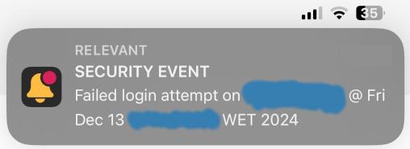
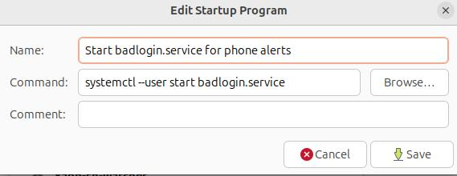

Would you like to receive a push notification/alert on your phone and/or a SMS if someone tries to log into your Ubuntu (with invalid credentials) while your user session is locked?

If so, this is your program.

This software will send you a push notification and/or a SMS to your mobile device when someone tries to log into your computer with invalid credentials while your user session is locked. The notifications are sent immediately as long as the network connection is active. It runs a user service in the background. The service runs as your system user but it detects login attempts to any of the local users of your computer as long as you have an active session.

- For the SMS, it has been tested with [Voipbuster](https://www.voipbuster.com) as SMS provider. This provider uses HTTP GET for the SMS API.
- For the push notifications, it has been tested with [Push by Techulus](https://push.techulus.com/) as Push provider. This provider uses HTTP POST for the notifications API.
  Hint: With this provider, if the app has active notifications that stay as unread in app icon, then: open the app and hit on #feed, then scroll to the bottom. The notifications should clear out.

However, you should be able to use other providers as long as they provide an API. I have provided these just as examples.

## Requirements

Linux
(tested on Ubuntu >= 20.04)

python3

## Installation

`mkdir -p $HOME/software/code/`

`mkdir -p $HOME/software/logs/`

Copy `badlogin.sentinel.sh`, `badlogin_sentinel2.py`, `badlogin_alert.sh`, `credentials.txt` onto `$HOME/software/code/`

Copy `badlogin.service` onto `$HOME/.config/systemd/user/badlogin.service`

`cd $HOME/software/code/ ; chmod u+x badlogin_checkline.sh badlogin_sentinel.sh badlogin_sentinel2.py badlogin_alert.sh`

Edit `credentials.txt` and fill it with your data for the Push provider and/or for the SMS provider.

This software has push notifications enabled by default and SMS notifications by default. To change this, edit `badlogin_alert.sh`

Replace `yourusername` with your system user name in `badlogin_checkline.sh`, in the two places it appears.

`systemctl --user enable badlogin.service`

`systemctl --user start badlogin.service`

Add a startup program in the Startup Applications app with the command `systemctl --user start badlogin.service` as shown below

## Troubleshooting

Check `$HOME/software/logs/badlogin_pushorsms.log`

Check `$HOME/software/logs/badlogin_sentinel.log` (It generates a log entry daily at midnight so you can check that the daemon is alive)

`systemctl --user status badlogin.service` (This should give you `active (running)`)

`/usr/bin/python3 --version` (To check that you have python installed)

If you want to generate an alert:
`sudo su`
`echo 'authentication failure - TEST' >> /var/log/auth.log`
Don't forget to `exit` once finished

## License

See the [LICENSE](LICENSE)